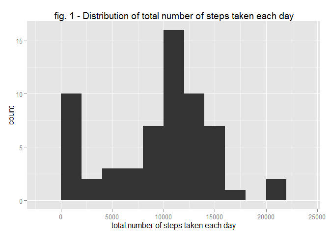
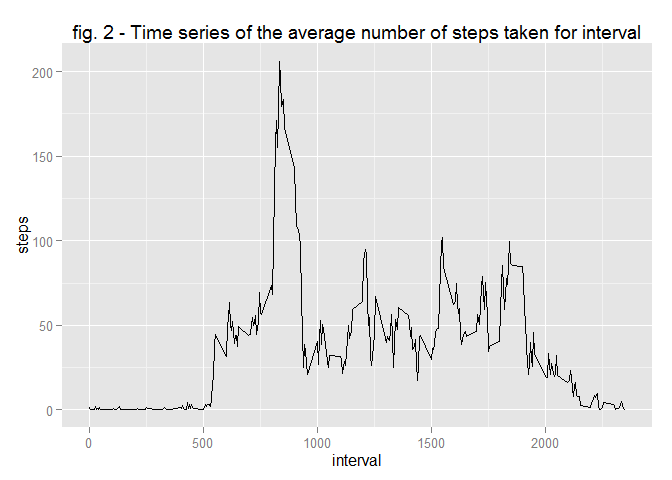
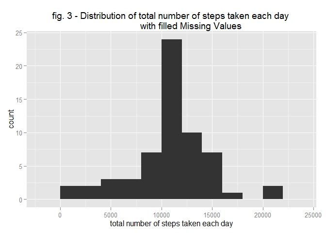
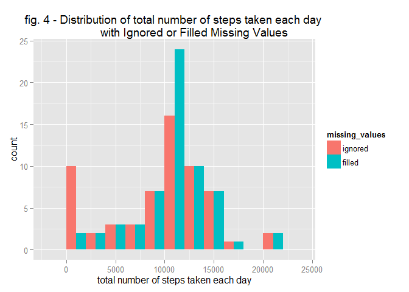
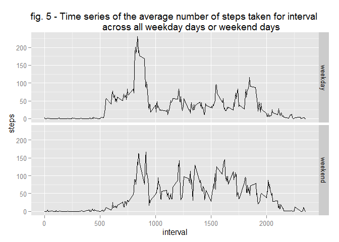

# Reproducible Research: Peer Assessment 1


## Loading and preprocessing the data

```r
data <- read.csv("activity.csv")
data$date <- as.Date(data$date)
summary(data)
```

```
##      steps             date               interval     
##  Min.   :  0.00   Min.   :2012-10-01   Min.   :   0.0  
##  1st Qu.:  0.00   1st Qu.:2012-10-16   1st Qu.: 588.8  
##  Median :  0.00   Median :2012-10-31   Median :1177.5  
##  Mean   : 37.38   Mean   :2012-10-31   Mean   :1177.5  
##  3rd Qu.: 12.00   3rd Qu.:2012-11-15   3rd Qu.:1766.2  
##  Max.   :806.00   Max.   :2012-11-30   Max.   :2355.0  
##  NA's   :2304
```


## What is mean total number of steps taken per day?
Total number of steps taken per day

```r
sum_day <- tapply(data$steps, data$date, FUN = sum, na.rm = TRUE)
head(sum_day)
```

```
## 2012-10-01 2012-10-02 2012-10-03 2012-10-04 2012-10-05 2012-10-06 
##          0        126      11352      12116      13294      15420
```

Histogram of the total number of steps taken each day

```r
library(ggplot2)
ggplot()+
geom_histogram(aes(sum_day), binwidth = 2000)+
        ggtitle("fig. 1 - Distribution of total number of steps taken each day")+
        xlab("total number of steps taken each day")
```

 

Mean of the total number of steps taken each day

```r
mean(sum_day)
```

```
## [1] 9354.23
```

Median of the total number of steps taken each day

```r
median(sum_day)
```

```
## [1] 10395
```


## What is the average daily activity pattern?

Time series of the 5-minute interval and the average number of steps taken, averaged across all days.

```r
mean_interval <- tapply(data$steps, data$interval, mean, na.rm = TRUE)
ggplot()+geom_line(aes(as.numeric(names(mean_interval)), mean_interval))+
        ggtitle("fig. 2 - Time series of the average number of steps taken for interval")+
        xlab("interval")+ylab("steps")
```

 

Which 5-minute interval, on average across all the days in the dataset, contains the maximum number of steps.

```r
names(mean_interval[max(mean_interval)])
```

```
## [1] "1705"
```

## Imputing missing values

Total number of missing values in the dataset.

```r
colSums(is.na(data))
```

```
##    steps     date interval 
##     2304        0        0
```

Devise a strategy for filling in all of the missing values.

```r
mean_day <- tapply(data$steps, data$date, mean, na.rm = TRUE)
median_day <- tapply(data$steps, data$date, median, na.rm = TRUE)
test <- subset(data, !is.na(data$steps))
for (i in 1:length(test$steps)) {
        test$mean_interval[i] <- mean_interval[as.character(test[i,3])]
        test$mean_day[i] <- mean_day[as.character(test[i,2])]
        test$median_day[i] <- median_day[as.character(test[i,2])]
        }
summary(test[,c(1,4,5,6)])
```

```
##      steps        mean_interval        mean_day         median_day
##  Min.   :  0.00   Min.   :  0.000   Min.   : 0.1424   Min.   :0   
##  1st Qu.:  0.00   1st Qu.:  2.486   1st Qu.:30.6979   1st Qu.:0   
##  Median :  0.00   Median : 34.113   Median :37.3785   Median :0   
##  Mean   : 37.38   Mean   : 37.383   Mean   :37.3826   Mean   :0   
##  3rd Qu.: 12.00   3rd Qu.: 52.835   3rd Qu.:46.1597   3rd Qu.:0   
##  Max.   :806.00   Max.   :206.170   Max.   :73.5903   Max.   :0
```
Mean for 5-minute interval looks the better choice here. 
 
Filling missing values with mean for that 5-minute interval.

```r
data2 <- data
for (i in 1:length(data2$steps)) {
        if (is.na(data2[i,1])) {
        data2[i,1] <- mean_interval[as.character(data2[i,3])]}
        }
```

Histogram of the total number of steps taken each day with filled Missing Values.

```r
sum_day2 <- tapply(data2$steps, data2$date, FUN = sum, na.rm = TRUE)
ggplot()+
geom_histogram(aes(sum_day2), binwidth = 2000)+
        ggtitle("fig. 3 - Distribution of total number of steps taken each day 
                with filled Missing Values")+
        xlab("total number of steps taken each day")
```

 

Mean of the total number of steps taken each day for with filled Missing Values.

```r
mean(sum_day2)
```

```
## [1] 10766.19
```

Median of the total number of steps taken each day for with filled Missing Values.

```r
median(sum_day2)
```

```
## [1] 10766.19
```


These values differ from the estimates done before filling the Missing Values:
- mean of the total number of steps taken each day increased from 9354 to 10766
- median of the total number of steps taken each day increased from 10395 to 10766

Also the distribution of the total daily number of steps is different, as you can see below there are less between 0 and 2500 and more between 10.000 and 12.500.

```r
comparison <- rbind(data.frame(sum = sum_day,missing_values = "ignored"),
                    data.frame(sum = sum_day2, missing_values = "filled"))

ggplot(comparison, aes(x=sum, fill=missing_values)) +
        geom_histogram(binwidth=2000, position="dodge")+
        ggtitle("fig. 4 - Distribution of total number of steps taken each day 
             with Ignored or Filled Missing Values")+
        xlab("total number of steps taken each day")
```

 

## Are there differences in activity patterns between weekdays and weekends?

Introduce a new factor variable for weekdays and weekends.

```r
data2$weekday <- as.factor((weekdays(data2$date) == "domenica") + (weekdays(data2$date) == "sabato"))
levels(data2$weekday) <- c("weekday", "weekend")
```

Plot the time series of the average number of steps taken for interval across all weekday days or weekend days.

```r
ggplot(data2, aes(x = interval, y = steps)) + stat_summary(fun.y = mean, geom = "line")+ 
        facet_grid(weekday~.)+
        ggtitle("fig. 5 - Time series of the average number of steps taken for interval 
             across all weekday days or weekend days")
```

 
